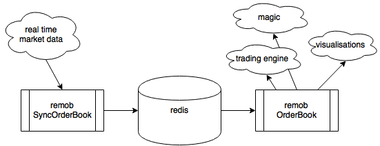

# remob
**REM**ote **O**rder**B**ook

**remob** is a Python based, redis backed, order book for financial instruments which allows an order book to be kept remotely on redis and accessed for analysis quickly and easily. 

**NOTE** : This is meant to be an order book which syncs to an existing market. It will not automatically match maker/taker orders. It is designed to accept matching messages and maintain order book sync with an active marketplace. 

* [Bid/Ask] Add orders
* [Bid/Ask] Delete orders
* [Bid/Ask] Change orders
* Match Bid/Ask

## Basic Objects

### SyncOrderBook

The primary interface between real-time market data and remob. 

### OrderBook

The primary interface between remob and all outside analysis tools.

